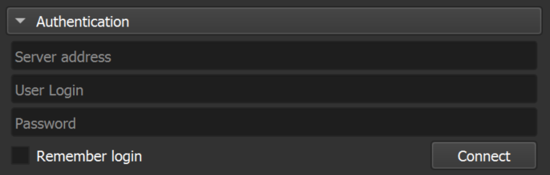

# Abstraction Adapter for Supervisely Computer Vision platform

A 3D Slicer extension designed to work with Labeling Jobs from Supervisely.

This extension allows you to work with Labeling Jobs just as you would on the Supervisely platform, but within the familiar environment of 3D Slicer. Labeling Jobs is a powerful tool for efficiently organizing and distributing data annotation tasks within a team. It ensures annotators work on well-defined portions of the dataset, follow consistent guidelines, and contribute to the project's success while maintaining data quality and accuracy. It's a critical component of effective team coordination in data annotation efforts.

You can read more about Labeling Jobs in our blog post [Mastering Labeling Jobs: Your Ultimate Guide](https://supervisely.com/blog/labeling-jobs/).

## Dependencies

The functionality of this extension relies on utilizing the [Supervisely Python SDK](https://supervisely.readthedocs.io/en/latest/index.html), which, in turn, requires a **Python 3.8+** version.

⚠️ Therefore, the extension cannot be used with 3D Slicer versions below **5.2.0**.

## Labeling Jobs Annotation Module Preview

This module enables annotators to annotate with all the conveniences and submit annotated data to the platform, set statuses for completed volumes, and submit Labeling Jobs for review.

**Slicer Annotation Process** UI example

**Supervisely Annotation Process** UI example

## Labeling Jobs Review Module Preview

This module allows reviewers to make changes to annotations, approve or reject the work done by annotators, and restart or complete Labeling Jobs.

**Slicer Review Process** UI example

**Supervisely Review Process** UI example

## Basic Tutorial

1. Navigate to the "Supervisely" section in the list of available modules and select the required module.
2. In the Authentication tab, enter the required data

   

   You can save your authentication by selecting the required option, or you can remain logged in for this work session only.

3. Select the team in which Labeling Jobs are waiting for you to annotate. Only the teams you are a member of will be listed.
4. Select Labeling Job from the list. Only those Jobs whose status is `Pending` or `In progress`, and you are the annotator for them, are displayed in the list.
5. Click Start labeling. The data will be downloaded from the server and saved in the `Working directory` which can be adjusted in the Settings section.
6. Select the Volume you want to work with. Segmentations will be automatically created to represent classes of annotation objects.

   

7. To create a new object, simply select any of the Segmentation and add a new Segment. When creating objects, it is not necessary to name them and change their color, as they will be converted to class names and colors once they are uploaded to the server. If during the creation process you need to change the name or color for convenience, you can do so without worrying about how it will be saved.
8. Add the necessary tags for Volume.
9. If your work on this Volume is complete, click the `Mark as Done` button. This will save your work and designate the Volume with the necessary status, which will help not only you when switching between Volumes, but also the reviewer to realize that the annotation of this Volume is complete.
10. Once the work in this Labeling Job is complete, click on the `Submit for review` button. The current Labeling Job will change status to `On review` and drop from the list of available jobs. It is now ready for the review process.
