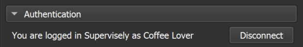

# Connect To **Supervisely** Computer Vision platform

  <a href="#Dependencies">Dependencies</a> •
  <a href="#Labeling-Jobs-Annotation-Module-Preview">Preview</a> •
  <a href="#Basic-Tutorial">Tutorial</a> •
  <a href="#Module-Settings-and-Options">Module Settings</a> •
  <a href="#Release-Notes">Release Notes</a>  

A 3D Slicer extension designed to organize and manage the work of labeling teams on the **Supervisely** computer vision platform.

This extension allows you to work with Labeling Jobs just as you would on the **Supervisely** platform, but within the familiar environment of 3D Slicer. Labeling Jobs is a powerful tool for efficiently organizing and distributing data annotation tasks within a team. It ensures annotators work on well-defined portions of the dataset, follow consistent guidelines, and contribute to the project's success while maintaining data quality and accuracy. It's a critical component of effective team coordination in data annotation efforts.

You can read more about Labeling Jobs in our blog post [Mastering Labeling Jobs: Your Ultimate Guide](https://supervisely.com/blog/labeling-jobs/).

## Dependencies

The functionality of this extension relies on utilizing the [Supervisely Python SDK](https://supervisely.readthedocs.io/en/latest/index.html), which, in turn, requires:

- **Python 3.8** or later.
- **3D Slicer 5.4.0** or later.

## Labeling Jobs Annotation Module Preview

This module enables annotators to annotate with all the conveniences and submit annotated data to the platform, set statuses for completed volumes, and submit Labeling Jobs for review.

**Slicer Annotation Process** UI example

**Supervisely Annotation Process** UI example

## Labeling Jobs Review Module Preview

This module allows reviewers to make changes to annotations, accept or reject the work done by annotators, and restart or complete Labeling Jobs.

**Slicer Review Process** UI example

**Supervisely Review Process** UI example

## Basic Tutorial

1. If you are new to **Supervisely**, please learn how our platform works and start at [this point](https://docs.supervisely.com/).

   Organize Team and Workspace, prepare Project, import data, create Labeling Job.

   [Video Explanation how it works](https://www.youtube.com/watch?v=YwNHbvyZL7Q)

2. Go to the 3D Slicer and navigate to the "Supervisely" section in the list of available modules and select the required module.

3. In the Authentication tab, enter the required data

   Here you can specify on which **Supervisely** server your data is located, as well as enter account credentials to connect to the server.

   

   If you are using Community Edition instance - use [app.supervisely.com](https://app.supervisely.com/) server address. **Supervisely** Enterprise users use their own instance addresses.

   You can save your authentication by ticking `Remember login` checkbox,

   

   or you can remain logged in for this work session only.

4. Select the team in which Labeling Jobs are waiting for you to annotate. Only the teams you are a member of will be listed.
5. Select Labeling Job from the list. Only those Jobs whose status is `Pending` or `In progress`, and you are the annotator for them, are displayed in the list.
6. Click Start labeling. The data will be downloaded from the server and saved in the `Working directory` which can be adjusted in the Settings section.
7. Select the Volume you want to work with. Segmentations will be automatically created to represent classes of annotation objects.

   

8. To create a new object, simply select any of the Segmentation and add a new Segment. When creating objects, it is not necessary to name them and change their color, as they will be converted to class names and colors once they are uploaded to the server. If during the creation process, you need to change the name or color for convenience, you can do so without worrying about how it will be saved.
9. Add the necessary tags for Volume.
10. If your work on this Volume is complete, click the `Mark as Done` button. This will save your work and designate the Volume with the necessary status, which will help not only you when switching between Volumes, but also the reviewer to realize that the annotation of this Volume is complete.
11. Once the work in this Labeling Job is complete, click on the `Submit for review` button. The current Labeling Job will change status to `On review` and drop from the list of available jobs. It is now ready for the review process.

## Module Settings and Options

### Remember login

The information with the server address and the account token received at the first login is saved to a `.env` file for further simplified connection to the platform.

### Ignore Segment status on Save

When this setting is checked (default), all segments will be saved regardless of their status.

Otherwise, segments with the status `Completed` will be saved, and segments with the status `In progress` will initiate a save request.

Segments with all other statuses will not be saved, but their current state in the current scene not change. To reset their state you will need to change the current Volume to another one and get back. Or reload the current Labeling Job. (Local reset will be added in the future)

⚠️ Deleted segments are deleted on save regardless of settings and statuses.

### Auto save when changing Volume

This setting allows you not to lose changes if you switch between Volumes and forget to save manually.

### Auto save on "Submit for review"

`Annotation module only`

This setting automates saving (by pressing the button manually) at the moment when you are going to send the Labeking Job for review, having finished working on the last Volume. If you have made some changes after the previous save, but want to send it for review without these last changes - uncheck the checkbox before that.

### Restart Job with only rejected volumes

`Review module only`

There are two options for restarting the Job:

1. By default, it restarts the Job only with those Volumes that are marked as `Rejected`.
2. When the current setting is off, it automatically marks all unmarked Volumes (all that are not marked `Accepted` or `Rejected`) as `Rejected` and restarts the job like the first option.

### Working directory

The user can configure the working directory where data will be stored locally when working with the Labeling Job.

## Release Notes

#### v0.0.1

☝️ Does not support recording statistics
